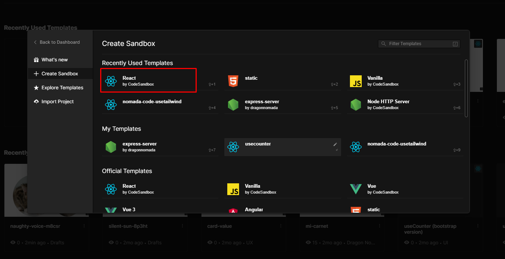
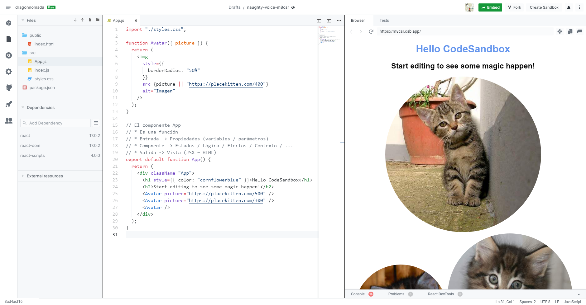

# Introducción a React Native

Por [Dragón Nómada](https://dragonnomada.medium.com)

## ¿Qué es React?

React es un Framework de Desarrollo de Aplicaciones Web creado por Facebook.

Está basado en el lenguaje de JavaScript y utiliza el pseudolenguaje llamado JSX para definir componentes extensibles al estilo HTML dentro del código de javascript.

Sus principales caracterísiticas son:

* Se basa en **Componentes**, los cuales tienen el objetivo de determinar una pieza visual que será pintada dada propiedades y estados.
* Se pueden definir los **Componentes como funciones**. La función recibe como parámetro un objeto de propiedades y devuelve un fragmento visual al estilo HTML. Es como una caja que dado propiedades de entrada devuelve una vista como salida.
* Se puede anclar funcionalidad a los componentes mediante **Hooks**. Los _hooks_ son funciones especiales que comienzan con el prefijo `'use'` y devuelven una interfaz basada en código replicable como estados, efectos, y demás.

Puedes consultar más información en el sitio oficial.

[https://es.reactjs.org](https://es.reactjs.org)

## ¿Qué es React Native?

Es una adaptación del Framework React para construir aplicaciones nativas para IOS y Android.

Se basa en utilizar componentes nativos expuestos mediante componentes, los cuales determinan la construcción final hacia IOS o Android, según se compile.

Por ejemplo, un componente `TextInput` podría ser implementado mediante el control nativo para IOS o el nativo para Android.

Puedes consultar más información en el sitio oficial.

[https://reactnative.dev](https://reactnative.dev)

## Introducirnos a React

Podemos comenzar a trabajar con React a través de [https://codesandbox.io](https://codesandbox.io).

Por ejemplo, podemos comenzar a definir componentes dentro de `App.js`.

